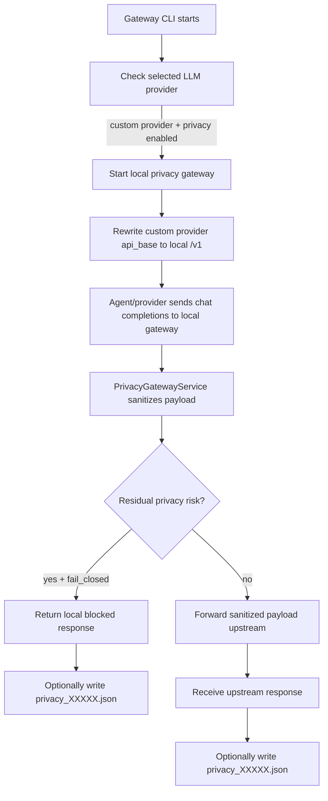
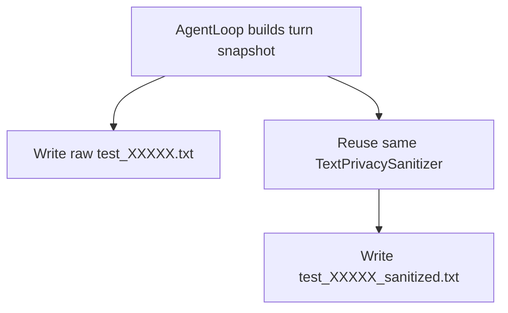

# Privacy Pipeline

This document explains the full privacy-filtering pipeline in Nanobot: why it exists, when it runs, which files participate, what artifacts it writes, and what it does **not** currently do.

The goal of the pipeline is simple:

- prevent private client data from being sent to a cloud LLM endpoint
- keep local debug artifacts so masking behavior can be inspected
- fail closed when the sanitizer still detects risky text after masking

---

## 1. Background and intent

Nanobot works with WhatsApp insurance conversations. Those prompts can contain private information such as:

- client names
- phone numbers
- chat IDs
- group names
- policy or ticket numbers
- living addresses
- occupations
- family-member names

If those values are sent directly to a cloud LLM, they leave the local machine. The privacy pipeline inserts a local masking layer before that happens.

There are actually **two related privacy paths** in the repo:

1. **Runtime outbound privacy gateway**
   - used for cloud-bound chat-completions traffic
   - masks data before forwarding upstream
   - can block the request if risky text remains

2. **Local debug snapshot sanitization**
   - used to write readable files into `test_words/`
   - lets you compare raw and sanitized prompt material locally
   - does not send anything by itself

These two paths reuse the same core sanitizer.

---

## 2. Key files

### Core pipeline files

- `nanobot/config/schema.py` — privacy config model
- `nanobot/cli/commands.py` — decides whether to start and route through the local privacy gateway
- `nanobot/privacy/gateway_server.py` — local HTTP server exposing `/v1/chat/completions`
- `nanobot/privacy/gateway.py` — request handling, sanitization, forwarding, debug persistence
- `nanobot/privacy/sanitizer.py` — deterministic masking engine
- `nanobot/agent/loop.py` — local raw/sanitized snapshot writer for `test_words/`

### Artifacts and tests

- `test_words/test_XXXXX.txt` — raw prompt snapshot
- `test_words/test_XXXXX_sanitized.txt` — sanitized prompt snapshot with `SANITIZER_META`
- `test_words/privacy_XXXXX.json` — sanitized request/response record from the gateway
- `tests/test_privacy_sanitizer.py` — rule-level sanitizer tests
- `tests/test_privacy_gateway.py` — gateway forwarding and fail-closed tests

---

## 3. High-level flow



Separate local debug path:



---

## 4. Step-by-step runtime pipeline

### Step 1 — Privacy config exists in the root config model

File: `nanobot/config/schema.py`

`PrivacyGatewayConfig` defines the privacy gateway controls:

- `enabled`
- `listen_host`
- `listen_port`
- `fail_closed`
- `save_redacted_debug`
- `text_only_scope`
- `enable_ner_assist`

Important notes:

- `fail_closed=True` means a request is blocked if validation still sees risky data after masking.
- `save_redacted_debug=True` means sanitized gateway artifacts are written locally.
- `text_only_scope=True` means the sanitizer is focused on text blocks.
- `enable_ner_assist` is present in config/env wiring, but there is no active NER implementation in the current sanitizer code path.

### Step 2 — CLI decides whether requests should go through the local privacy gateway

File: `nanobot/cli/commands.py`

Function: `_maybe_enable_privacy_gateway()`

This is the routing switch.

Current behavior:

- read the active model/provider from config
- if provider is **not** `custom`, do nothing
- if privacy gateway is disabled, do nothing
- otherwise:
  - determine the real upstream API base
  - start the local privacy gateway process
  - rewrite `config.providers.custom.api_base` to the local gateway URL

This means the privacy gateway is currently used specifically for the `custom` provider path.

Related helper functions:

- `_privacy_gateway_url()` builds `http://<host>:<port>/v1`
- `_build_privacy_gateway_env()` exports the real upstream and privacy flags to the child process
- `_start_privacy_gateway()` launches `python -m nanobot.privacy.gateway_server`

### Step 3 — The local gateway server accepts OpenAI-compatible requests

File: `nanobot/privacy/gateway_server.py`

This file is a thin HTTP adapter. It does not implement masking logic itself.

Responsibilities:

- expose `/healthz` for readiness checks
- expose `/v1/chat/completions`
- parse incoming JSON
- pass the request into `PrivacyGatewayService`
- write the normalized response back to the client

`main()` rebuilds `PrivacyGatewayConfig` from environment variables set by the CLI.

### Step 4 — `PrivacyGatewayService` handles one request

File: `nanobot/privacy/gateway.py`

Main function: `handle_chat_completions()`

Per-request flow:

1. call `TextPrivacySanitizer.sanitize_chat_payload()`
2. inspect the resulting `SanitizationResult`
3. if `result.blocked` is true:
   - build a local safe response with `build_blocked_response()`
   - optionally write `privacy_XXXXX.json`
   - return without calling the cloud
4. if not blocked:
   - forward only a limited set of headers upstream
   - send `result.sanitized_payload` to the cloud endpoint
   - parse the upstream response
   - optionally write `privacy_XXXXX.json`
   - return the upstream response to the caller

### Step 5 — The sanitizer performs deterministic masking

File: `nanobot/privacy/sanitizer.py`

This is the real privacy engine.

#### 5.1 Input model

It sanitizes chat-completions-style payloads, especially:

- `payload["messages"]`
- nested dict/list content
- known JSON keys such as `sender_name`, `sender_phone`, `chat_id`, `address`, `policy_number`

It also supports direct text redaction for local debug files through `redact_text_for_debug()`.

#### 5.2 Session-scoped placeholder memory

The sanitizer builds and updates a `placeholder_map`.

Example idea:

```text
"Hendrick" -> "Unknown Sender Name"
"+86 131 3610 1623" -> "Unknown Phone Number"
```

This map is cached per session in `_session_cache` so that repeated private tokens can be masked consistently across later payloads and debug text.

Session key extraction order:

1. inspect runtime metadata in messages for `Channel:` and `Chat ID:`
2. otherwise use `x-session-affinity` header
3. otherwise fall back to `global`

#### 5.3 Sanitization order inside `_sanitize_text()`

The order matters.

Current pass order:

1. apply already-known exact placeholders
2. sanitize structured line fields such as `Sender Name:` or `Address:`
3. sanitize JSON-like embedded fields
4. replace policy/ticket numbers
5. replace phone numbers
6. replace chat IDs
7. replace addresses
8. replace occupations
9. replace family-member names
10. apply exact placeholders again

That final exact-replacement pass helps catch repeated tokens that became obvious after earlier passes populated the placeholder map.

#### 5.4 What patterns are recognized

The current implementation includes rules for:

- runtime metadata lines such as `Sender Name`, `Sender Phone`, `Group Name`, `Chat ID`
- JSON string fields containing the same identity values
- generic phone-number patterns
- WhatsApp chat IDs such as `1203...@g.us`
- policy/ticket number patterns
- English and Chinese address cues and address-like fragments
- English and Chinese occupation cues
- English and Chinese family-member name cues

#### 5.5 Validation and fail-closed behavior

After masking, the sanitizer validates the result again.

Validation checks for things like:

- any original tokens from `placeholder_map` still appearing in text
- remaining phone numbers
- remaining chat IDs
- remaining policy/ticket numbers
- remaining addresses or address-like text
- remaining occupation or family-member cues
- structured or JSON fields whose values are not replaced

If validation returns reasons and `fail_closed=True`, then:

- `SanitizationResult.blocked = True`
- the gateway returns a local safe response instead of calling upstream

#### 5.6 Important limitation: no reverse restoration path

There is currently **no active rehydration step** that converts placeholders back into the original private values after the cloud responds.

The `placeholder_map` is used for:

- consistent masking
- validation
- debug visibility

It is **not** currently used to transform cloud responses back into private text.

So today the pipeline is:

```text
raw local text -> sanitized outbound text -> sanitized stored/debug text
```

not:

```text
raw -> sanitized outbound -> cloud response -> private local rehydration
```

---

## 5. Local debug snapshot path in `AgentLoop`

File: `nanobot/agent/loop.py`

This path is easy to confuse with the gateway, but it is separate.

`_write_turn_snapshot()` does the following for each prompt snapshot:

1. build a raw local snapshot of system prompt, history, memory, and user payload
2. write it to `test_words/test_XXXXX.txt`
3. run the same `TextPrivacySanitizer` on the prompt messages
4. run `redact_text_for_debug()` on `memory/MEMORY.md` and `memory/HISTORY.md`
5. write a sanitized snapshot to `test_words/test_XXXXX_sanitized.txt`
6. include `SANITIZER_META`, including `blocked`, `reasons`, and `placeholder_map`

This path is for inspection and debugging. It does not itself decide cloud routing.

---

## 6. Debug artifacts and what each one means

### `test_words/test_XXXXX.txt`

Raw local snapshot. Usually includes:

- turn info
- full system prompt
- chat history for the turn
- memory text
- history text
- user payload

### `test_words/test_XXXXX_sanitized.txt`

Sanitized version of the same snapshot. Adds:

- `SANITIZER_META`
- `blocked`
- `reasons`
- `placeholder_map`

### `test_words/privacy_XXXXX.json`

Gateway-generated sanitized request/response record. Fields include:

- `created_at`
- `session_key`
- `blocked`
- `reasons`
- `upstream_url`
- `sanitized_request`
- `response_status`
- `sanitized_response`

Important nuance:

- `test_XXXXX*.txt` files come from `AgentLoop`
- `privacy_XXXXX.json` comes from the privacy gateway service

---

## 7. Tests that explain intended behavior

### `tests/test_privacy_sanitizer.py`

This file shows the intended masking contract:

- runtime metadata should be masked
- repeated sender names should be masked consistently
- free-text phone/address/occupation/ticket/family data should be masked
- known sensitive dict keys should be masked by key-aware logic
- timestamp fragments should not be mistaken for phone numbers
- normal phrases like `policy terms` should not be false positives
- already-masked addresses should not be flagged again

### `tests/test_privacy_gateway.py`

This file shows the gateway contract:

- the local gateway should forward only sanitized payloads upstream
- original payload objects passed into the gateway should remain unchanged outside the service
- a `privacy_XXXXX.json` file should be written when enabled
- fail-closed mode should return a local safe message and skip upstream

---

## 8. Subtle implementation details worth knowing

### Client names are stored in session data, not only transient prompt context

For WhatsApp flows, a client name can appear in several places:

- Baileys inbound `pushName` in the bridge layer
- inbound metadata as `sender_name` / `push_name`
- per-message `session.jsonl` entries
- per-session metadata fields such as `client_name`, `client_label`, `client_push_name`, and `client_display_name`
- top-level `meta.json` fields plus the nested `client` object

The runtime context block may also contain `Sender Name: ...`, but that line is prompt-time context, not the canonical long-term storage location.

### The sanitizer is deterministic, not model-based

Current masking is based on regexes, known key names, and exact-token replay from the session cache.

### The `workspace` argument is not what chooses `test_words/`

`privacy_debug_dir()` currently returns the repo-root `test_words/` directory via:

```text
Path(__file__).resolve().parents[2] / "test_words"
```

So the gateway debug directory is currently anchored to the repo, not dynamically to `workspace`.

### `text_only_scope` is narrow in current behavior

The only visible media-related branch in the sanitizer is for content blocks with `type == "image_url"`.
The current implementation remains primarily text-focused.

### `enable_ner_assist` is wired but not active

The config and environment variable exist, but there is no active NER-assisted masking logic in the current sanitizer implementation.

---

## 9. Recommended reading order

If you want to understand the code quickly, read in this order:

1. `PRIVACY_PIPELINE.md`
2. `nanobot/config/schema.py` — config surface
3. `nanobot/cli/commands.py` — when routing is enabled
4. `nanobot/privacy/gateway_server.py` — HTTP entrypoint
5. `nanobot/privacy/gateway.py` — request lifecycle
6. `nanobot/privacy/sanitizer.py` — masking engine
7. `nanobot/agent/loop.py` — local raw/sanitized snapshots
8. `tests/test_privacy_sanitizer.py`
9. `tests/test_privacy_gateway.py`

---

## 10. One-sentence mental model

Nanobot currently protects cloud-bound prompts by routing `custom` provider traffic through a local OpenAI-compatible gateway that sanitizes outbound text, validates the masked result, optionally blocks unsafe payloads, and writes local debug artifacts — but it does **not** currently restore original private values back into responses.