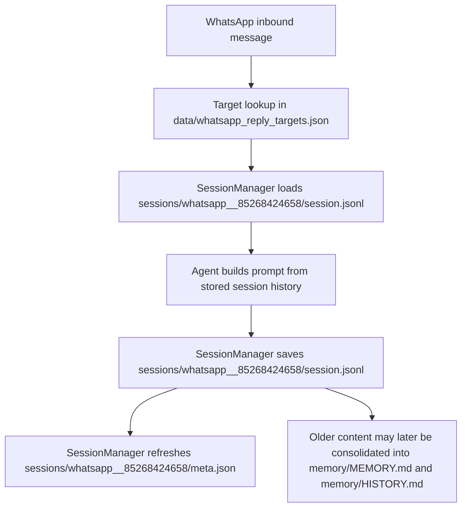

# Nanobot / Insurance Flow Data Structure Guide

This document describes the current storage model after the WhatsApp cleanup and bundle migration.

The key conclusion is simple:

```text
sessions/ is the source of truth for per-chat context.
```

---

## 1. Current Runtime Root

The project now uses the repo itself as the default workspace root:

```text
/Users/nijiachen/Nanobot-Whatsapp/
```

That means runtime state now lives directly inside this project instead of being split across a separate hidden workspace by default.

---

## 2. Current Storage Layout

```text
Nanobot-Whatsapp/
├── bridge/
│   └── src/
│       ├── index.ts                     ← bridge entrypoint; wires CDP mode/env into the Node bridge
│       ├── server.ts                    ← WebSocket bridge; fans out Baileys history and CDP scrape results
│       ├── whatsapp.ts                  ← Baileys client; live inbound handling + full-history sync events
│       └── draft.ts                     ← CDP/Playwright browser driver; draft insertion + WhatsApp Web history scrape
├── config.json                          ← runtime config
├── data/
│   ├── contacts/
│   │   └── whatsapp.json                ← direct contact cache
│   ├── whatsapp_groups.csv              ← group member allowlist / cache
│   └── whatsapp_reply_targets.json      ← routing + toggle state
├── nanobot/
│   ├── privacy/
│   │   ├── sanitizer.py                 ← deterministic masking rules before cloud send
│   │   ├── gateway.py                   ← sanitize + forward + save privacy debug payloads
│   │   └── gateway_server.py            ← local OpenAI-compatible privacy gateway server
│   └── skills/
│       ├── README.md                    ← built-in skill index
│       └── <skill>/SKILL.md             ← skill instructions and helper assets
├── memory/
│   ├── MEMORY.md                        ← global long-term memory
│   └── HISTORY.md                       ← global summarized memory log
├── sessions/
│   ├── whatsapp__85268424658/
│   │   ├── meta.json                    ← readable bundle summary
│   │   └── session.jsonl                ← authoritative chat history
│   ├── whatsapp__120363425294796483@g.us__85295119020/
│   │   ├── meta.json
│   │   └── session.jsonl
│   ├── whatsapp__120363425294796483@g.us__85296010357/
│   │   ├── meta.json
│   │   └── session.jsonl
│   └── whatsapp__120363425808631928@g.us__8613136101623/
│       ├── meta.json
│       └── session.jsonl
├── test_words/
│   ├── test_XXXXX.txt                   ← prompt/test artifacts
│   ├── test_XXXXX_sanitized.txt         ← sanitized prompt artifacts
│   ├── privacy_XXXXX.json               ← privacy/debug artifacts
│   ├── .counter
│   └── .privacy_counter
├── tests/
│   ├── test_privacy_sanitizer.py        ← unit coverage for masking rules
│   └── test_privacy_gateway.py          ← end-to-end gateway/privacy tests
├── whatsapp-auth/                       ← Baileys linked-device auth state
├── whatsapp-web/                        ← Chrome profile for WhatsApp Web / CDP
└── data_structure.md                    ← this document
```

Removed from the live model:
- flat `sessions/*.jsonl` as canonical runtime storage
- `sessions/readable/`
- `Chathistories/`

---

## 3. Source of Truth by Responsibility

### 3.1 Per-chat conversation context

Source of truth:

```text
sessions/<bundle>/session.jsonl
```

This is the authoritative transcript used for:
- loading a chat session
- saving new inbound/outbound turns
- reconstructing prompt history
- historical deduplication and deletion markers

### 3.2 Per-chat readable metadata summary

Companion file:

```text
sessions/<bundle>/meta.json
```

This is not the primary transcript store.
It is a canonical companion summary for the same chat bundle and usually contains:
- `key`
- `created_at`
- `updated_at`
- `message_count`
- `metadata`
- `client_name`
- cached identity hints like `client_label`, `client_push_name`, `client_phone`
- nested `client` identity object for easier parsing
- the path to `session.jsonl`

### 3.3 Routing and toggle state

Source of truth:

```text
data/whatsapp_reply_targets.json
```

This file stores control-plane state such as:
- whether a target is enabled
- whether `auto_draft` is enabled
- chat identity fields like `phone`, `chat_id`, `sender_id`
- `push_name`, `label`, and timestamps like `last_seen_at`

It does **not** store the conversation transcript.

### 3.4 Global memory

Sources of truth:

```text
memory/MEMORY.md
memory/HISTORY.md
```

These are workspace-wide memory files, not per-chat history stores.

### 3.5 Debug and privacy artifacts

Location:

```text
test_words/
```

This folder is only for debugging, prompt capture, and privacy validation.

---

## 4. Session Bundle Model

Each WhatsApp chat maps to one bundle directory inside `sessions/`.

### Direct chat example

Session key:

```text
whatsapp:85268424658
```

Bundle directory:

```text
sessions/whatsapp__85268424658/
```

Files:

```text
sessions/whatsapp__85268424658/meta.json
sessions/whatsapp__85268424658/session.jsonl
```

### Group member example

Session key:

```text
whatsapp:120363425294796483@g.us:85295119020
```

Bundle directory:

```text
sessions/whatsapp__120363425294796483@g.us__85295119020/
```

Files:

```text
sessions/whatsapp__120363425294796483@g.us__85295119020/meta.json
sessions/whatsapp__120363425294796483@g.us__85295119020/session.jsonl
```

---

## 5. What is inside `session.jsonl`

`session.jsonl` is plain text.

Line 1 is a metadata header.
Every following line is a persisted message record.

Example shape:

```jsonl
{"_type":"metadata","key":"whatsapp:85268424658","created_at":"...","updated_at":"...","metadata":{...},"last_consolidated":98}
{"role":"client","content":"Hi","timestamp":"...","message_id":"..."}
{"role":"me","content":"😁","timestamp":"...","message_id":"..."}
```

Important metadata fields:

| Field | Meaning |
|---|---|
| `_type` | identifies the metadata header line |
| `key` | canonical session key |
| `created_at` / `updated_at` | lifecycle timestamps |
| `metadata` | per-chat workflow state |
| `last_consolidated` | how much of the chat has already been consolidated into global memory |

Important message fields:

| Field | Meaning |
|---|---|
| `role` | `client` or `me` in persisted WhatsApp sessions |
| `content` | message text or placeholders like `[Image]` |
| `timestamp` | persisted event time |
| `message_id` | WhatsApp message identifier or generated outbound ID |
| `chat_id` | WhatsApp JID |
| `sender_id` / `sender_phone` | sender identity details when available |
| `from_me` | whether the message originated from the agent side |

---

## 6. Is `sessions/` really the source of truth?

Yes.

That is true in both storage structure and runtime behavior.

### Why the answer is yes

1. `SessionManager` resolves chats into `sessions/<bundle>/session.jsonl` and `sessions/<bundle>/meta.json`.
2. Session loading reads the bundle `session.jsonl` directly.
3. Session saving writes back to the same `session.jsonl` and refreshes the paired `meta.json`.
4. Old flat session files and old readable layouts are migrated into this bundle model.
5. WhatsApp prompt construction uses the full stored WhatsApp session history, so the runtime is drawing context from these bundled session files.

Practical conclusion:

```text
If you want the real context for a chat, inspect sessions/<bundle>/session.jsonl.
```

---

## 7. What `reply_targets` still does

`data/whatsapp_reply_targets.json` remains important, but for a different responsibility.

It answers questions like:
- Which contacts are active targets?
- Is `auto_draft` enabled for this person?
- Which `chat_id` and `sender_id` should be associated with the target?
- What display hints do we currently know?

It does **not** answer:
- What was the full conversation?
- What is the authoritative message history?

So:

```text
reply_targets = routing state
sessions = actual conversation state
```

---

## 8. Where client names are saved

Names can appear in multiple layers.

### A. Structured identity data

Usually from `data/whatsapp_reply_targets.json` and cached into session metadata:
- `label`
- `push_name`
- `client_label`
- `client_push_name`
- `client_display_name`

### B. Session bundle metadata

`sessions/<bundle>/meta.json` stores the best currently known display-oriented values for that chat.

That now includes a cleaner explicit name layer:
- `client_name` = best human name, preferring label then push name
- `client.display_name` = best display-safe identifier, which may fall back to phone
- `client.label` / `client.push_name` = source-specific hints kept separately

### C. Transcript content

A name can also appear only inside message text.

Example:
- `Rachael` may exist in transcript content even if it is not yet the structured label for that contact.

So “name in transcript” and “name in structured metadata” are related but not identical.

### D. Exact WhatsApp name flow

For WhatsApp direct chats, the usual path is:

1. Baileys inbound event provides `pushName`
2. bridge normalizes it into the event payload
3. `nanobot/channels/whatsapp.py` passes it as `sender_name` / `push_name`
4. `AgentLoop` stores it into `session.jsonl` message entries
5. `SessionManager` promotes the best available value into session metadata as:
    - `client_name`
    - `client_label`
    - `client_push_name`
    - `client_display_name`
6. `meta.json` exposes both the flat fields and nested `client` object for parsing

---

## 9. What `memory/` does

`memory/` is global workspace memory.

Files:

```text
memory/MEMORY.md
memory/HISTORY.md
```

Meaning:
- `MEMORY.md` = long-term facts
- `HISTORY.md` = summarized historical log

These files may receive consolidated information from sessions later, but they do not replace the primary chat transcript stored in `sessions/<bundle>/session.jsonl`.

---

## 10. What `test_words/` does

`test_words/` is a debug and privacy-validation area.

Typical contents:
- raw prompt captures
- sanitized prompt captures
- privacy comparison results
- internal counters

It is not part of the live chat context path.

### 10.1 Privacy filtering stack, in parallel

If you want to inspect the private-data filtering path quickly, these are the files that matter side-by-side:

```text
nanobot/privacy/sanitizer.py            = core masking rules for names, phones, chat IDs,
                                          policy/ticket numbers, addresses, occupations,
                                          and family-member names
nanobot/privacy/gateway.py              = applies the sanitizer before cloud send and writes
                                          privacy_XXXXX.json debug payloads
nanobot/privacy/gateway_server.py       = local /v1/chat/completions endpoint in front of the cloud model
nanobot/config/schema.py                = privacyGateway config model
nanobot/cli/commands.py                 = starts the privacy gateway and rewrites custom provider traffic through it
tests/test_privacy_sanitizer.py         = rule-level tests for masking behavior
tests/test_privacy_gateway.py           = end-to-end tests for sanitized forwarding and fail-closed mode
test_words/test_XXXXX.txt               = raw prompt capture examples
test_words/test_XXXXX_sanitized.txt     = sanitized prompt output examples
test_words/privacy_XXXXX.json           = saved sanitized request/response debug records
nanobot/skills/README.md                = built-in skill index, useful as a nearby reference tree
nanobot/skills/<skill>/SKILL.md         = skill definitions, separate from privacy filtering
```

Important current behavior:
- `test_words/` contains artifacts and examples, not the sanitizer logic itself.
- The actual filtering logic lives in `nanobot/privacy/`.
- The current implementation sanitizes outbound payloads before they go to the cloud.
- There is currently no separate “normalize back to original private values” module in this path; responses are stored and returned in sanitized form when placeholders remain.

### 10.2 WhatsApp CDP + historical parsing stack, in parallel

If you want the exact files for the CDP connection path and the historical-message parsing path, these are the ones to inspect side-by-side:

```text
bridge/src/index.ts                     = Node bridge entrypoint; reads WEB_BROWSER_MODE / WEB_CDP_URL and starts the bridge
bridge/src/server.ts                    = accepts prepare_draft and scrape_direct_history commands; rebroadcasts history batches to Python
bridge/src/draft.ts                     = actual CDP browser connection and WhatsApp Web DOM scraping logic
bridge/src/whatsapp.ts                  = actual Baileys socket logic; live messages + messaging-history.set replay
nanobot/cli/commands.py                = Python startup side; builds bridge env, launches/reuses CDP Chrome, starts the bridge
nanobot/channels/whatsapp.py           = Python channel side; requests sync_direct_history, receives history batches, filters/imports them
data/whatsapp_reply_targets.json       = decides which direct chats are eligible for startup/manual history sync
sessions/<bundle>/session.jsonl        = canonical destination for imported historical messages after dedupe/filtering
whatsapp-auth/                         = Baileys linked-device auth state
whatsapp-web/                          = persistent Chrome profile used by the CDP browser
nanobot/skills/README.md               = nearby skill index reference
nanobot/skills/<skill>/SKILL.md        = skill definitions; separate from WhatsApp transport/history code
data/*.csv / data/*.json               = business-side source data; separate from transport/history ingestion
```

The split of responsibility is:

- `bridge/src/whatsapp.ts` = Baileys algorithm for live traffic and full-history replay.
- `bridge/src/draft.ts` = CDP algorithm for attaching to Chrome and scraping older WhatsApp Web chat history from the DOM.
- `bridge/src/server.ts` = merges those bridge-side outputs into `history` events.
- `nanobot/channels/whatsapp.py` = imports those `history` events into Nanobot's session pipeline.
- `sessions/<bundle>/session.jsonl` = final authoritative per-chat history after import.

Quick mental model:

```text
Baileys history path:
bridge/src/whatsapp.ts  ->  bridge/src/server.ts  ->  nanobot/channels/whatsapp.py  ->  sessions/<bundle>/session.jsonl

CDP scrape path:
nanobot/channels/whatsapp.py  ->  bridge/src/server.ts  ->  bridge/src/draft.ts  ->  bridge/src/server.ts  ->  nanobot/channels/whatsapp.py  ->  sessions/<bundle>/session.jsonl
```

---

## 11. End-to-End Flow for One Direct Chat

Example chat:

```text
85268424658
```



This is the current live path.

---

## 12. Fastest Way to Inspect One Chat

For a phone like `85268424658`, inspect in this order:

1. `data/whatsapp_reply_targets.json`
2. `sessions/whatsapp__85268424658/session.jsonl`
3. `sessions/whatsapp__85268424658/meta.json`
4. `memory/MEMORY.md` and `memory/HISTORY.md` only if you want the global consolidated view

This gives you:
- routing/toggle state
- the true transcript
- the current readable summary
- any global memory extracted later

---

## 13. Final Mental Model

```text
config.json                         = runtime configuration
data/whatsapp_reply_targets.json    = routing + toggle state
sessions/<bundle>/session.jsonl     = authoritative per-chat context
sessions/<bundle>/meta.json         = canonical readable chat summary
memory/*.md                         = global memory
test_words/                         = debug and privacy artifacts
whatsapp-auth/                      = Baileys auth state
whatsapp-web/                       = WhatsApp Web browser profile
```
